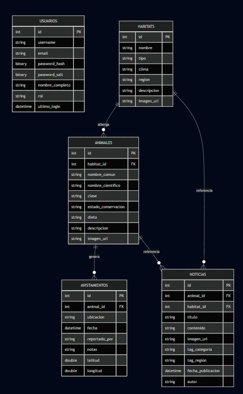

# Fauna Atlas — Atlas de Vida Salvaje

Fauna Atlas es un sistema web integral diseñado para el registro, gestión y exploración de la fauna silvestre regional. El proyecto combina una interfaz de usuario moderna y fluida con un backend robusto basado en Clean Architecture, permitiendo a los usuarios descubrir especies, hábitats y registrar avistamientos de forma segura.

## Tecnologías Principales

### Frontend
- **Framework**: React + TypeScript
- **Bundler**: Vite
- **Estilos**: Tailwind CSS v4
- **Gestión de Formularios**: React Hook Form + Zod
- **Iconos**: React Icons (FontAwesome, Feather)
- **Navegación**: React Router DOM v6

### Backend
- **Framework**: .NET 10.0
- **ORM**: Entity Framework Core
- **Base de Datos**: SQL Server
- **Validación**: FluentValidation
- **Seguridad**: Autenticación JWT + HMACSHA512
- **Arquitectura**: Clean Architecture (API, Application, Domain, Persistence)

## Requisitos del Sistema

- **Node.js**: v18.0 o superior.
- **.NET SDK**: v10.0 o superior.
- **SQL Server**: Express o superior.

## Configuración y Ejecución Local

### 1. Clonar el repositorio
```bash
git clone <url-del-repositorio>
cd PruebaTecnica
```

### 2. Configuración del Backend
Dirígete a la carpeta `API` y restaura las dependencias.
```bash
cd API
dotnet restore
```
**Base de Datos**: El sistema utiliza **Migraciones Automáticas**. Al ejecutar el proyecto por primera vez, el servidor creará la base de datos y la poblará con datos semilla. `DefaultConnection` en `appsettings.json` debe apuntar a tu instancia local de SQL Server.

Para ejecutar el servidor:
```bash
dotnet run
```
*El API estará disponible por defecto en `http://localhost:5069`.*

---

## Credenciales de Acceso

Para facilitar las pruebas de autenticación y roles, puedes utilizar las siguientes cuentas precargadas:

| Rol | Usuario | Contraseña |
| :--- | :--- | :--- |
| **Administrador** | `admin` | `123456` |
| **Usuario Normal** | `juan_explorador` | `123456` |

---

### 3. Configuración del Frontend
En una nueva terminal, dirígete a la carpeta `Client`.
```bash
cd Client
npm install
```

Para iniciar el entorno de desarrollo:
```bash
npm run dev
```
*La aplicación web se abrirá en `http://localhost:5173`.*

---

##  Arquitectura del Proyecto

El proyecto sigue el patrón de **Clean Architecture** para garantizar escalabilidad:

- **Domain**: Entidades puras de negocio (Animal, Habitat, Avistamiento, Usuario, Noticia).
- **Persistence**: Contexto de datos (EF Core), Migraciones y lógica de Seeding.
- **Application**: DTOs, Validadores (FluentValidation) y Métodos de Extensión para el mapeo (ToDto/UpdateEntity).
- **API**: Controladores REST, Middlewares de seguridad (Logging, Seguridad HSTS) y configuración de servicios.

---

## Características

- **Validación Integral**: Validación dual (Frontend con Zod y Backend con FluentValidation) para máxima integridad de datos.
- **Seguridad Robusta**: Control de acceso mediante roles (Usuario/Admin) y protección de contraseñas con Salting/Hashing.
- **Optimización**: Renderizado optimizado en formularios mediante el patrón de componentes no controlados (RHF).

---

## Extras
- **Middlewares personalizados**: Auditoría de peticiones mediante logging centralizado.
- **Patrones de Mapeo**: Uso de extensiones transversales.

## Esquema
